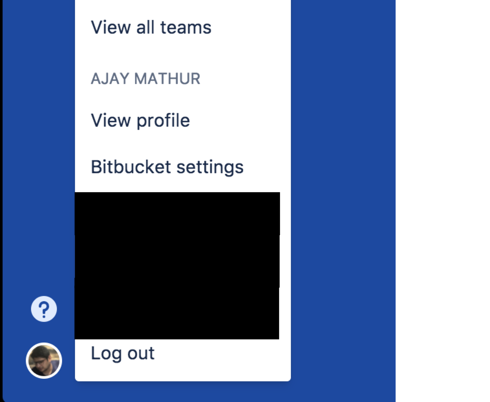
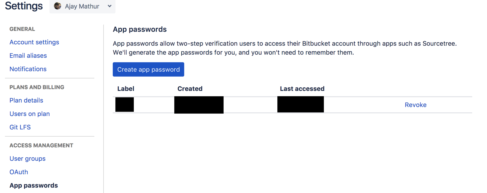

# Generating authentication token

## Bitbucket Pipelines:

> Bitbucket has a detailed guide on generating [app passwords](https://confluence.atlassian.com/bitbucket/app-passwords-828781300.html).

Make sure you have 2FA activated on your account.

1. Go to bitbucket setting on your account

2. Go to app password and create password

3. Use your bitbucket username and this app password for authentication.

`<BitbucketUserName>:<AppPassword>`

#### Tips:

- Use an app password for pipelines that has the minimum set of permissions.

## Travis:

> [Detailed guide](https://blog.travis-ci.com/2013-01-28-token-token-token) to get travis token from travis blog
