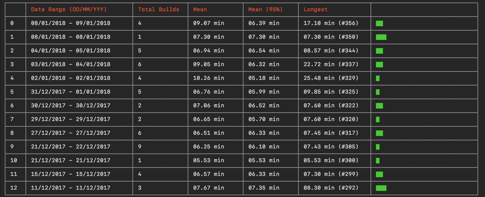

# build-stats

> Get the stats of your pipeline.



## Install

```sh
yarn global add build-stats
```

## Example

```js
build-stats travis:boltpkg/bolt download // download the build data
build-stats travis:boltpkg/bolt calculate // calculate the build stats from downloaded data
```

## Usage

```sh
build-stats <ciTool>:<user>/<repo> [command] --period <p> --last <l>
```

### `ciTool`

ciTool - The ciTool on which pipelines are hosted, supported Bitbucket Pipelines and Travis Ci.

### `user`

user - User running the pipelines

### `repo`

repo - Name of the repository to calculate stats for

### `command`

command - [download - to downlaod the build data | calculate - to calculate the mean and see the stats of build data].

### `--period <p>`

p - How many days in a time period to calculate the build stats for **default to 1**

 ### `--last <l>`

l - How many periods to calculate back to **defaults to 30**

